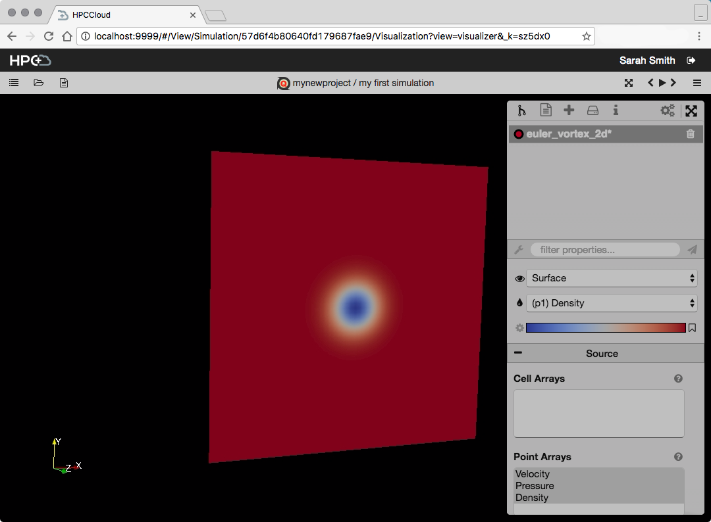

# Running simulation workflows

For this example we're going to run a basic PyFR simulation. There are sample files for this simulation in the PyFR repository [the input](https://raw.githubusercontent.com/vincentlab/PyFR/develop/examples/euler_vortex_2d/euler_vortex_2d.ini) and [the mesh](https://raw.githubusercontent.com/vincentlab/PyFR/develop/examples/euler_vortex_2d/euler_vortex_2d.msh). (If you're reading this on the web you can right click those links and "Save Link as..." to quickly download them) 

## Running

0. Create a traditional cluster or an AWS Profile which you can use. If you do not have access to either you can run the simulation in your VM by setting the environment variable `DEMO=1` before provisioning.
1. Create a project and select the type 'pyfr-exec', name it whatever you wish. 
2. Create a simulation, the input files mentioned above are required. Name the simulation whatever you wish.  

3. Go to your new simulation and click on the "Simulation" step in the left side bar.

4. Here you can select your cluster or AWS Profile to use. If you've set the environment variable `DEMO=1` then the cluster you seek is under the "Traditional" cluster type option.
5. Click "Run Simulation" and you'll be taken to the Simulation view sub-step. Here you can view logs and statuses of both tasks and jobs.  

When they all reach the "Complete" status your simulation has completed! A button "Visualize" will appear. Clicking on it will activate and take you to the disabled "Visualization" step in the sidebar.
6. Here in the visualization step you will run Paraview web and view the output of your simulation. So that Paraview has access to the simulation output, it must be run on the same machine as the simulation. Select the server and click "Start Visualization." You'll be taken to a job monitor page similar to the one for the Simulation step described in step 5.
7. Wait for the tasks to complete, and the primary job (ParaViewWeb) to be running. A button labeled "Visuzalize" will appear. Clicking this will take you to a ParaViewWeb tool in your browser where you can view and manipulate the output of your simulation.

## Terminating and Rerunning

At any time during steps 5 and 6 above there is a button labeled "Terminate." Clicking this will attempt to terminate the step's primary jobs and their tasks. Afterwards you'll have a "Rerun" button in its place. Clicking that button will bring you back to the Start page where you can run the job on the same cluster or provision a new one.
