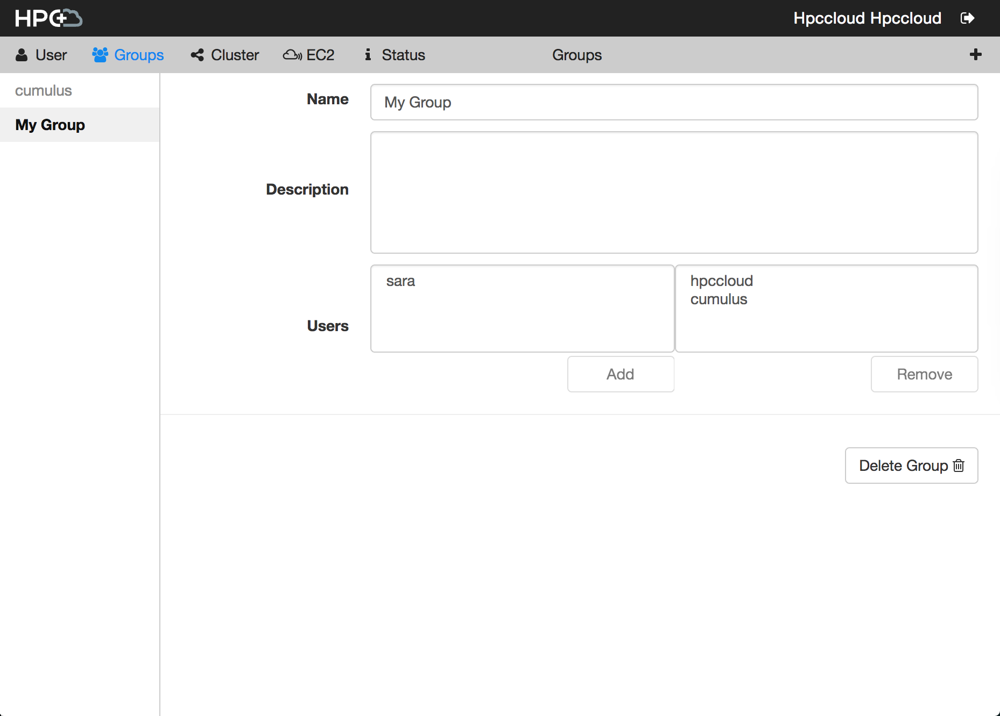
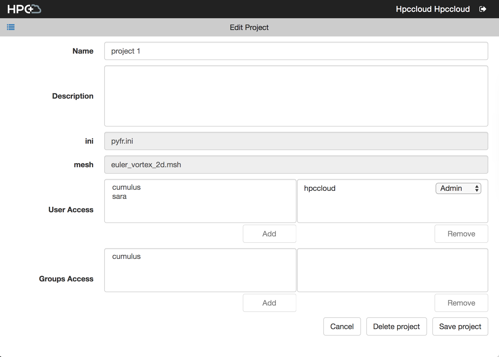

# Groups and Project Sharing

## Groups

Groups are collections of users that can have their own permissions assigned. Only admin users can create and manage groups. This is done through the Groups panel on the Preferences page.

## Project Sharing

Only a project owner can share projects and the corresponding simulations with groups and individual users. The sharing panel can be reached by going to the Edit panel for each project or simulation.

Sharing a project with users or groups also shares the simulations and the corresponding taskflows within. You can share individual simulations with users and groups as well, doing so will share the parent project but only the shared simulation will be visible to the sharees. 

Level of access per project and simulation can also be set. The possible values are Read, Write, and Admin. Beware setting admin permissions to groups and users on the project level as they will have access to all containing simulations and files.
